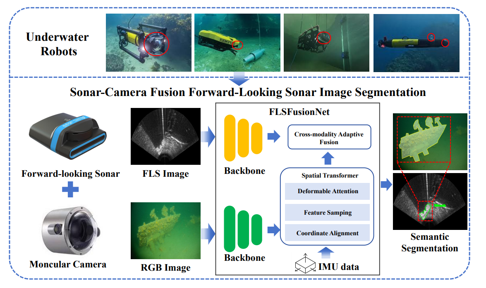

# Cross-modality Forward-Looking Sonar Image Segmentation for Autonomous Underwater Vehicles in Complex Underwater Condition
This is the official code release for our paper on underwater perception. 

## Abstract
Side-scan sonar (SSS) imaging segmentation is crucial for autonomous underwater vehicles (AUVs) to perceive and interpret underwater environments in real time. However, real-time SSS image segmentation remains a significant challenge due to the unique structural characteristics of SSS images, including strip-like formations, acoustic shadowing, and spatially varying resolution, as well as the stringent computational and energy constraints of AUV platforms. Traditional patch-based segmentation methods suffer from loss of global spatial context and increased computational redundancy, making them unsuitable for real-time deployment. To address these challenges, we propose MobileSonar, a novel lightweight segmentation framework designed for real-time SSS image segmentation in resource-constrained AUV environments. Our approach introduces a temporal fusion framework that preserves global spatial coherence by sequentially integrating historical feature representations. Furthermore, we design a Contextual Feature Fusion (CFF) Module to align and fuse historical and current SSS features, ensuring consistent segmentation across overlapping sonar regions. To enhance feature extraction efficiency in low-rank sparse SSS images, we introduce a decoupled frequency convolution module (DFCM), which separates background and target features in the frequency domain, reducing computational complexity while maintaining segmentation accuracy. We validate our approach through comprehensive experiments on the AI4Shipwrecks dataset, as well as real-world deployment on an AUV embedded platform powered by a Snapdragon 650-based mobile processor. Experimental results demonstrate that MobileSonar achieves an optimal balance between segmentation accuracy and computational efficiency, significantly outperforming conventional methods in real-time segmentation performance.

